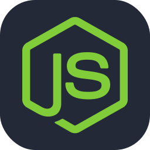

<header>
<h2>
    
🌐 Sobre Mim
  
</h2>
</header>

<br />

<div>   


```js
import Desenvolvedor from "CaiqueOrtega";

class SobreMim extends Desenvolvedor {
    constructor() {
        super();
        this.nome = "Caique Ortega";
        this.area = "Desenvolvimento de Software";
        this.objetivo = "Aprimorar habilidades em desenvolvimento";
        this.localizacao = "Cianorte - PR";
        this.interesses = ["Front-end", "React", "UI/UX Design"];
    }

    descrever() {
        return `Sou ${this.nome}, especializado em ${this.area} e localizado em ${this.localizacao}. Meu objetivo é ${this.objetivo}. Interesso-me por ${this.interesses.join(", ")}.`;
    }
};
```
</div>

<br />

<div align="center" >
<h2 align="center" >⚒️ Linguagens-Frameworks-Ferramentas ⚒️</h2>





</div>
    
<br />

<br />

<div align="center">
  <h2>📈 Estatísticas</h2>

  
  &nbsp;&nbsp;&nbsp;&nbsp; 
  
</div>

<br />

<footer>
<h1 align="center">

</h1>
</footer>