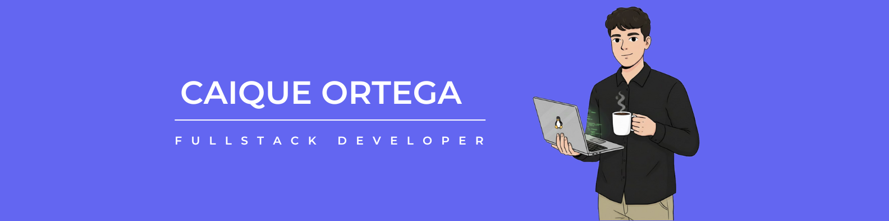

<header>
  <div>
    
  </div>
</header>

<br />
  
  ## 💻 Sobre Mim
  
```js
import Desenvolvedor from "CaiqueOrtega";

class SobreMim extends Desenvolvedor {
    constructor() {
        super();
        this.nome = "Caique Ortega";
        this.area = "Full Stack";
        this.localizacao = "Cianorte - PR";
        this.habilidadesTecnicas = {
            frontend: ["React", "Next.js", "TypeScript", "Node.js"],
            backend: ["Express", "NestJS", "Prisma", "PostgreSQL"],
            tools: ["Git", "Docker"]
        };
    }

    descrever() {
        return `Olá! meu nome é ${this.nome}, sou desenvolvedor ${this.area} atualmente, atuando em ${this.localizacao}.
        Adoro transformar ideias em aplicações práticas e eficientes, combinando ${this.habilidadesTecnicas.frontend.join(", ")} no frontend e ${this.habilidadesTecnicas.backend.join(", ")} no backend, sempre apoiado por ${this.habilidadesTecnicas.tools.join(" e ")}.
        Meu objetivo é criar soluções escaláveis, bem estruturadas e que realmente façam a diferença para quem as utiliza, sempre aprendendo e evoluindo no caminho.`;
    }
}

```


<div align="center">
  
## 🚀 Stack Tecnológicas

<p>
  
  
  
  
  
  
  
  
  
</p>
</div>

---
<div align="center">
  
</div>


